🛡️ Global Threat Intelligence Lab — Azure Sentinel SIEM & Honeypot
> **A fully engineered, cloud-native SOC pipeline — built on live brute-force attacks from real global threat actors.**


---
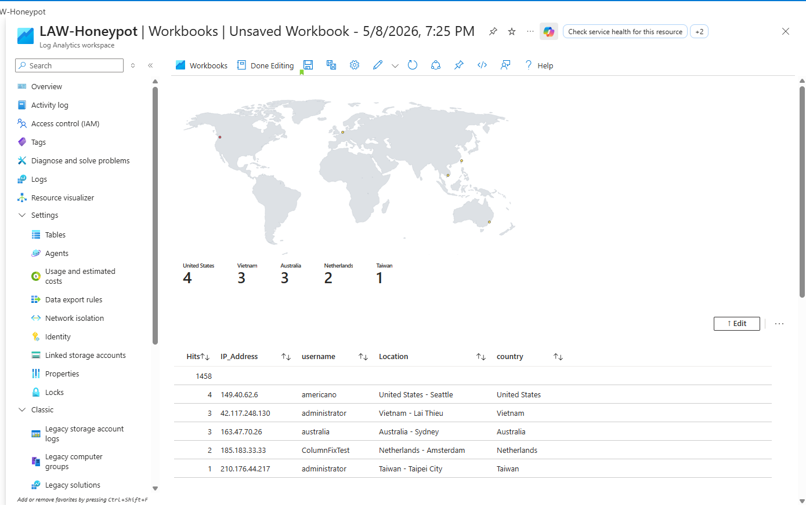
⭐ Project Milestone — Completed SOC map displaying live attack counts by country with enriched attacker data
---
📌 Executive Summary
I built this project to answer a simple question: what actually happens when you leave a Windows server exposed to the internet?
The answer came fast. Within hours, brute-force attempts were flooding in from across the globe — the USA, Vietnam, the Netherlands, Japan, Taiwan, and more. This project captures that entire experience: from spinning up a deliberately vulnerable Windows Server 2022 honeypot in Azure, to engineering a complete log ingestion pipeline into Microsoft Sentinel, to building a live KQL-powered SOC dashboard that maps every attack in real time.
> ⚡ **This is not a simulation. Every attack shown was a real attempt from a real IP address.**
Over 1,400 brute-force attempts were detected, enriched with geolocation data, and visualised within a single observation window.
---
🛠️ Tech Stack
Category	Technology
☁️ Cloud Platform	Microsoft Azure
🔍 SIEM	Microsoft Sentinel, Log Analytics Workspace
💻 Core Compute	Windows Server 2022 Datacenter
📜 Scripting & Querying	PowerShell, Kusto Query Language (KQL)
📡 Log Pipeline	Azure Monitor Agent (AMA), Data Collection Rule (DCR)
🌐 Enrichment	Third-Party IP Geolocation API
📊 Visualisation	Azure Workbooks
🕵️ Threat Hunting	Microsoft Defender Advanced Hunting
🌏 Region	Australia East
---
🏗️ Architecture
```
┌──────────────────────────────────────────────────────────────────┐
│                    INTERNET — Global Threat Actors               │
│        USA 🇺🇸  |  Netherlands 🇳🇱  |  Japan 🇯🇵  |  Vietnam 🇻🇳  │
└──────────────────────────┬───────────────────────────────────────┘
                           │  RDP (Port 3389) + ICMP
                           ▼
┌──────────────────────────────────────────────────────────────────┐
│              HONEYPOT-VM  (Azure — Australia East)               │
│         Windows Server 2022  |  Public IP: 20.11.49.204          │
│         Firewall: Disabled   |  NSG: All Inbound Open            │
└──────────────────────────┬───────────────────────────────────────┘
                           │  Event ID 4625 (Failed Logon)
                           ▼
┌──────────────────────────────────────────────────────────────────┐
│                  POWERSHELL AUTOMATION LAYER                     │
│   ► Monitors local Security Event Log in real-time               │
│   ► Calls IP Geolocation API → appends Lat/Long/Country/City     │
│   ► Writes enriched events to custom SIEM-ready .log file        │
└──────────────────────────┬───────────────────────────────────────┘
                           │  Custom Log Ingestion (DCR)
                           ▼
┌──────────────────────────────────────────────────────────────────┐
│           LOG ANALYTICS WORKSPACE + MICROSOFT SENTINEL           │
│   ► Azure Monitor Agent routes logs to SecurityEvent table       │
│   ► Custom table (FAILED_RDP_WITH_GEO_CL) ingested via DCR       │
│   ► KQL parses and transforms schema for geographic mapping      │
└──────────────────────────┬───────────────────────────────────────┘
                           │  Azure Workbook
                           ▼
┌──────────────────────────────────────────────────────────────────┐
│               REAL-TIME SOC DASHBOARD (Azure Workbook)           │
│   🔴 CRITICAL: Attacks within last 30 minutes                    │
│   🟡 HISTORICAL: Attacks within last 24 hours                    │
│   📋 Enriched table: Country, City, Username, Attack Count       │
└──────────────────────────────────────────────────────────────────┘
```
---
📋 Build Phases
Phase 1 — Infrastructure & Exposure
The initial phase established a controlled environment by deploying and deliberately weakening a cloud VM to attract global threat actors.
Created Resource Group `Honeypot-VM_group` for clean resource isolation
Provisioned `Honeypot-VM` — Windows Server 2022 Datacenter in Australia East
Disabled Windows Defender Firewall across Domain, Private, and Public profiles
Modified NSG rules to allow all inbound traffic on Port 3389 (RDP) and ICMP from any source IP
Configured Advanced Security Audit Policy to capture Logon Success and Failure events (Event ID 4625)
Verified public internet reachability via remote ICMP ping test
---
Phase 2 — SIEM Integration & Engineering Pivot
🚧 Real-world problem encountered:
The Azure Portal threw a `typeHandlerVersion` dependency error during Azure Monitor Agent installation — a known UI provisioning bug.
✅ Solution:
Bypassed the Portal entirely and deployed the AMA manually using Azure PowerShell via Cloud Shell — demonstrating real-world troubleshooting and CLI competency under pressure.
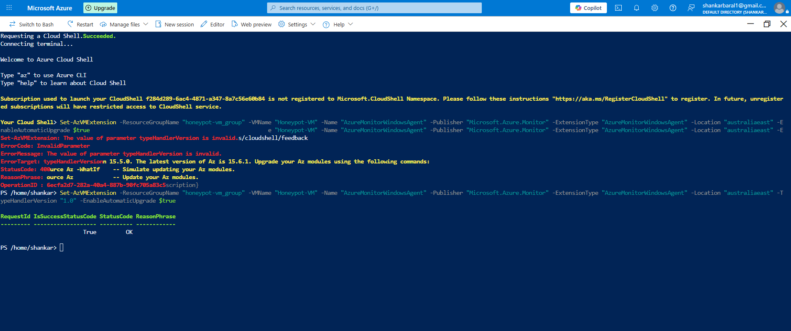
⭐ Critical Asset — Manual AMA deployment via Cloud Shell bypassing Portal UI bug
Engineered a Data Collection Rule (DCR) to route logs into the `SecurityEvent` table
Validated local Event ID 4625 generation with PowerShell before confirming cloud ingestion
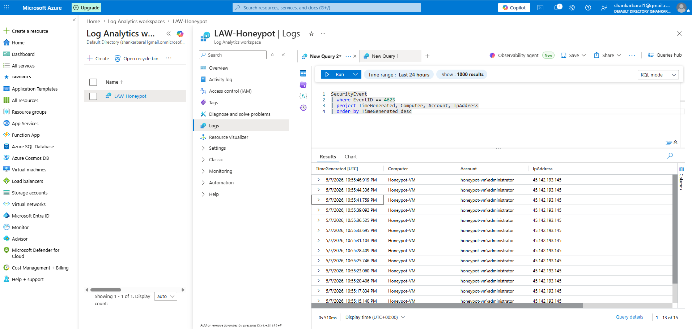
First successful KQL query confirming Event ID 4625 (Failed Logon) ingestion into Log Analytics Workspace
---
Phase 3 — Automation & Geolocation Enrichment
A raw IP address tells you nothing. I needed to know where the attacker was, not just that they existed. This phase built the enrichment layer that turned logs into intelligence.
Built a PowerShell loop that continuously monitors the local Security Event Log for brute-force attempts
Integrated a third-party IP Geolocation API to enrich each event with `Latitude`, `Longitude`, `Country`, and `City`
Output structured data to a custom `.log` file in a SIEM-ready schema
Performed controlled QA validation using a unique test identity (`Shankar_Test_AU`) to baseline and verify end-to-end accuracy before global exposure
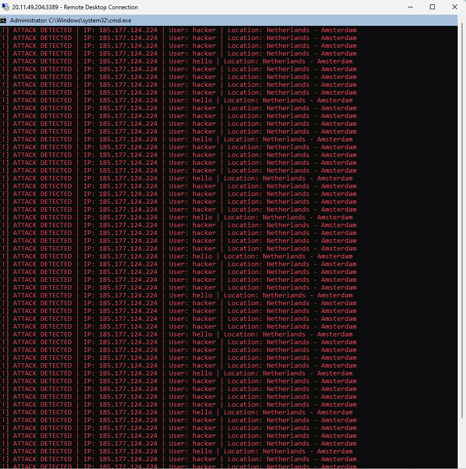
⭐ Real-time brute-force detection — Script catching and labelling live attacks from the Netherlands
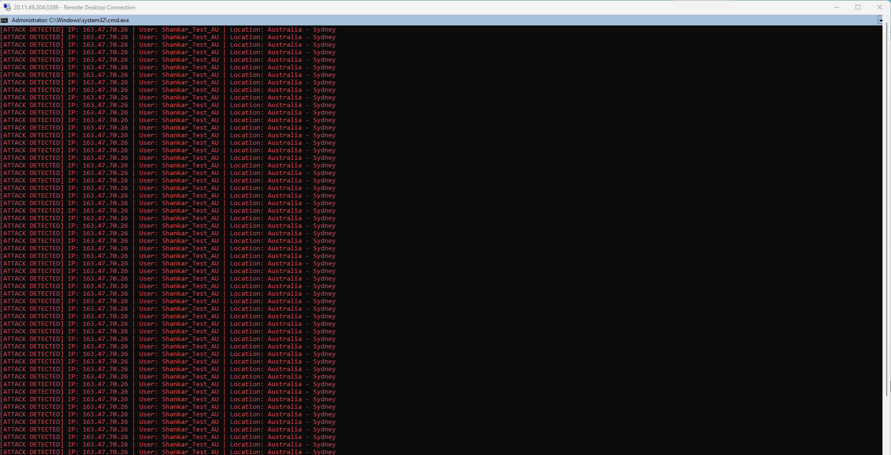
⭐ Quality Assurance — Controlled test with unique identity confirming pipeline accuracy before live deployment
---
Phase 4 — SOC Dashboard & Visualisation
Data sitting in a table is not intelligence — it needs to be seen. The final phase brought everything together into a production-grade Azure Workbook that any SOC analyst could sit down and use.
Ingested the custom `.log` file into Sentinel and verified the schema via KQL
Applied advanced KQL transformation: parsed string coordinates into `double` type for accurate geographic mapping
Resolved coordinate-summation display bugs during workbook orchestration
Configured Dual-State Urgency Logic:
🔴 CRITICAL (Red) — attacks detected within the last 30 minutes
🟡 Historical (Yellow) — attacks within the last 24-hour window
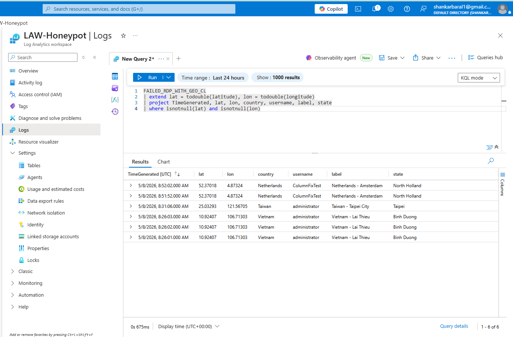
Advanced KQL — converting string coordinates to doubles for map plotting and projecting security fields
---
📊 Live Attack Results
> **1,400+ real brute-force attempts** detected and mapped during a single observation window.
Country	Attack Count	Status
🇺🇸 United States	4	🔴 High Velocity
🇻🇳 Vietnam	3	🔴 High Velocity
🇦🇺 Australia	3	🔴 High Velocity
🇳🇱 Netherlands	2	🟡 Active
🇹🇼 Taiwan	1	🟡 Active
🇯🇵 Japan	Detected	🟡 Active
---
🔁 Steps to Reproduce
Want to build this yourself? Below is the full lifecycle I followed — every step, including the parts that broke and had to be fixed.
Create a Microsoft Azure account and set up a free/pay-as-you-go subscription
Create a Resource Group (e.g., `Honeypot-VM_group`) in your preferred region
Deploy a Windows Server 2022 VM — note the Public IP address
Weaken the security posture:
Disable Windows Defender Firewall (Domain, Private, Public profiles)
Open NSG inbound rules for Port 3389 (RDP) and ICMP from any source
Configure Advanced Audit Policy inside the VM to log Event ID 4625 (Failed Logons)
Create a Log Analytics Workspace and link it to Microsoft Sentinel
Deploy the Azure Monitor Agent (AMA) — if the Portal fails, use Cloud Shell PowerShell
Create a Data Collection Rule (DCR) targeting the `SecurityEvent` table
Validate ingestion — run a KQL query for Event ID 4625 in Log Analytics
Write a PowerShell script to poll the local Security Event Log and call an IP Geolocation API
Output enriched logs to a custom `.log` file and ingest into Sentinel as a custom table
Verify the custom table with KQL (`FAILED_RDP_WITH_GEO_CL`)
Write KQL to parse coordinates — convert strings to `double` for map plotting
Build an Azure Workbook — add a map tile and attack details table with dual-state urgency logic
Observe, document, and iterate — let the attacks come to you
---
🔑 Skills Demonstrated
```
✅ Microsoft Sentinel      — End-to-end SIEM deployment and management
✅ Azure Cloud Engineering — VMs, NSGs, Log Analytics Workspaces, Workbooks
✅ KQL                     — Ingestion, parsing, type conversion, coordinate mapping
✅ PowerShell              — Real-time log monitoring and API integration
✅ Data Enrichment         — IP geolocation pipeline for threat intelligence
✅ Troubleshooting         — AMA deployment via Cloud Shell (bypassed Portal bug)
✅ SOC Dashboard Design    — Dual-state urgency logic and live visualisation
✅ Security Audit Policy   — Windows event log configuration for detection
✅ QA & Validation         — Controlled baseline testing with known identity
✅ Threat Hunting          — Microsoft Defender Advanced Hunting portal
```
---
📸 Full Screenshot Reference
#	Screenshot	What It Shows
01	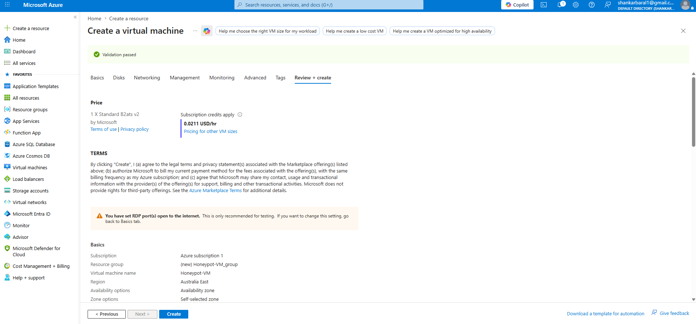	Final VM deployment review — RDP exposure confirmed
02	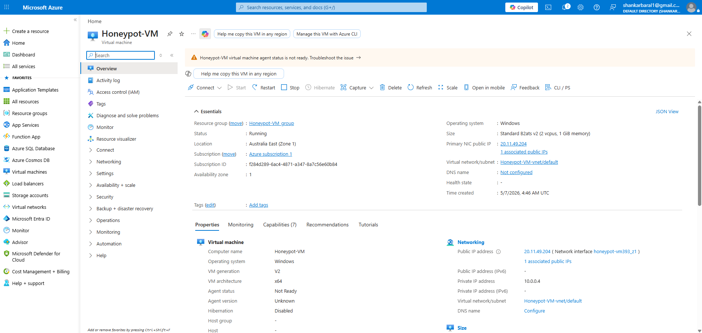	VM live in Australia East — Public IP documented
03	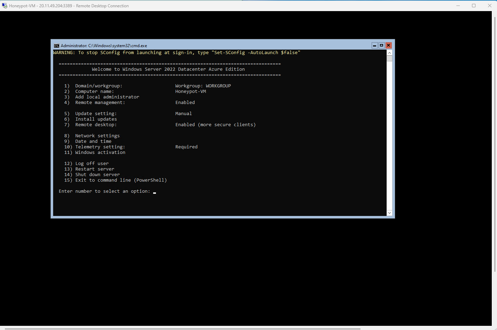	Initial RDP session into Windows Server 2022
04	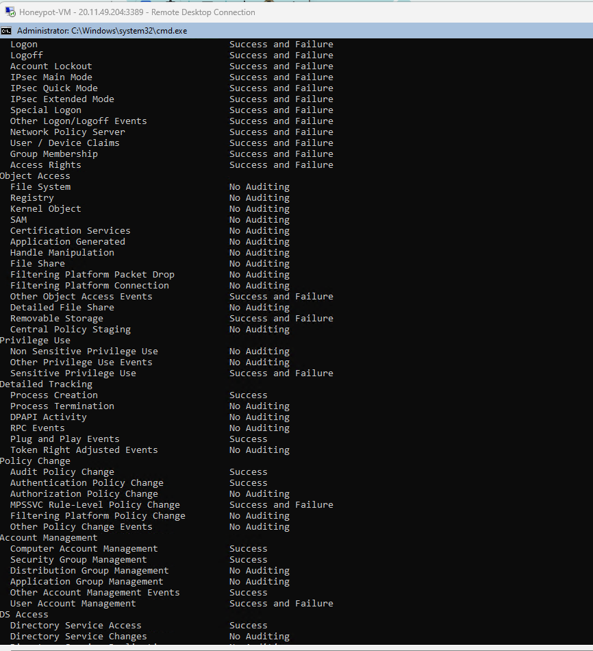	Manual audit policy config for Logon events
05	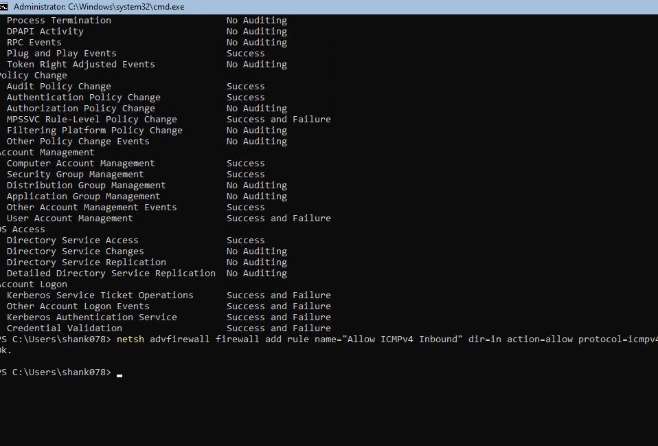	CLI execution permitting ICMP — VM visible to scanners
06	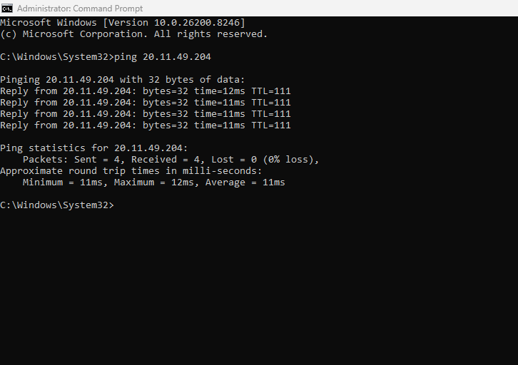	Successful ping — VM reachable over public internet
07	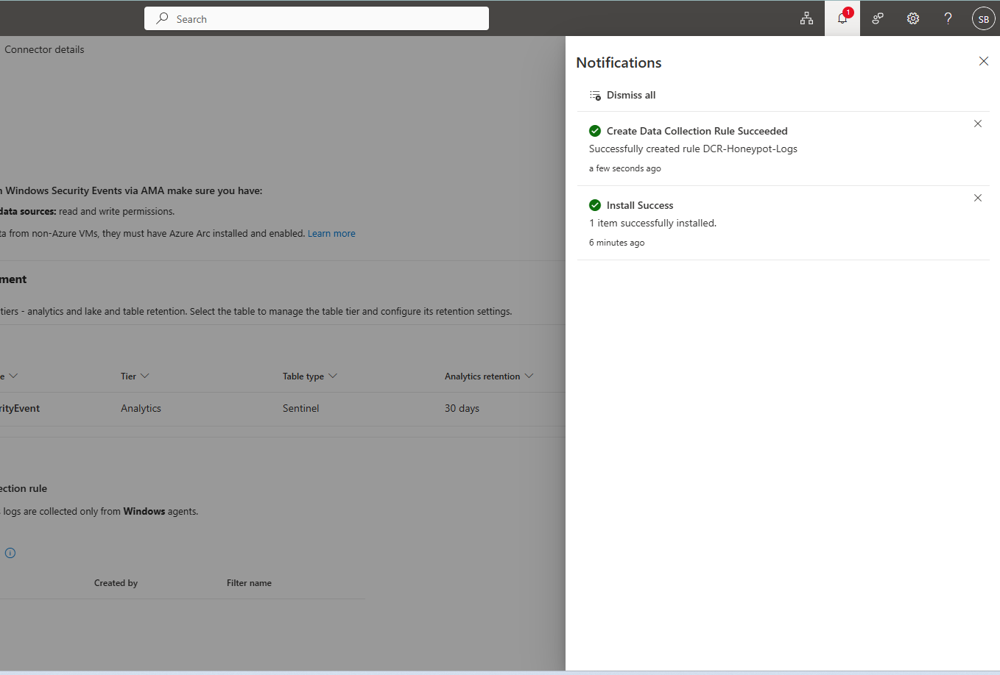	DCR deployed — AMA agent confirmed
08		⭐ AMA deployed via Cloud Shell — portal bug bypassed
09		⭐ First KQL query — Event ID 4625 ingested
10	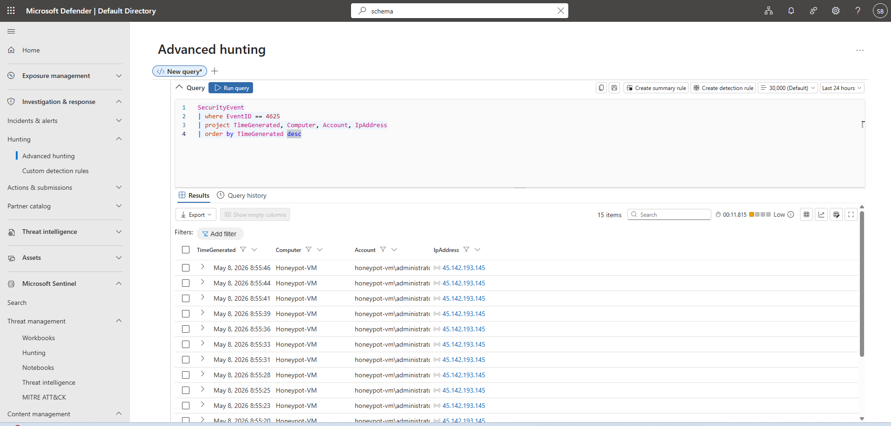	Cross-platform threat hunting in Defender portal
11	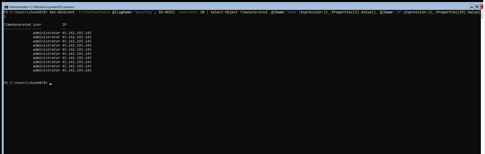	PowerShell verifying local event generation
12	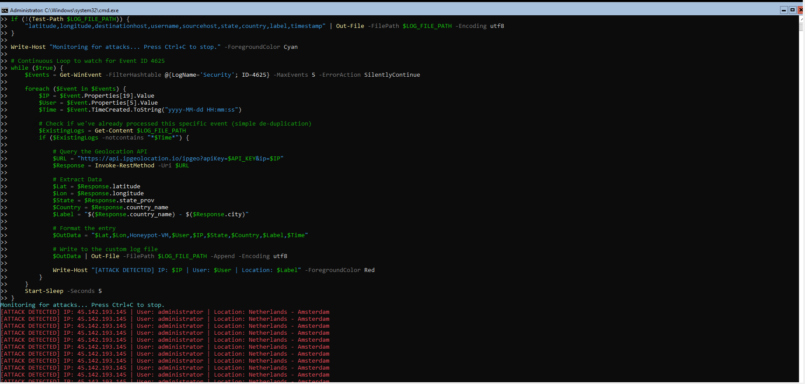	PowerShell loop + Geolocation API initialised
13		⭐ Real-time brute-force detection — Netherlands
14	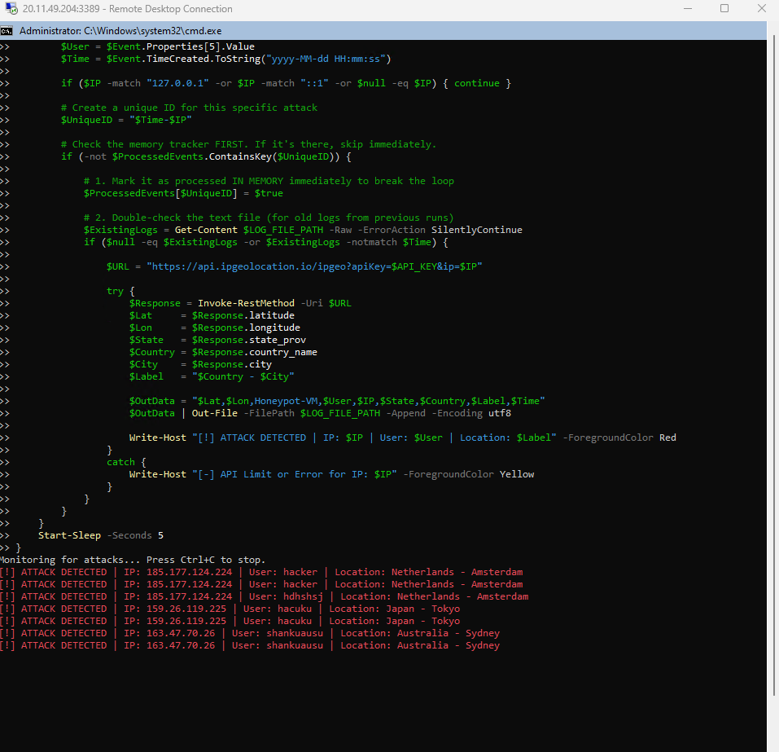	Script detecting hits from Japan and Sydney
15	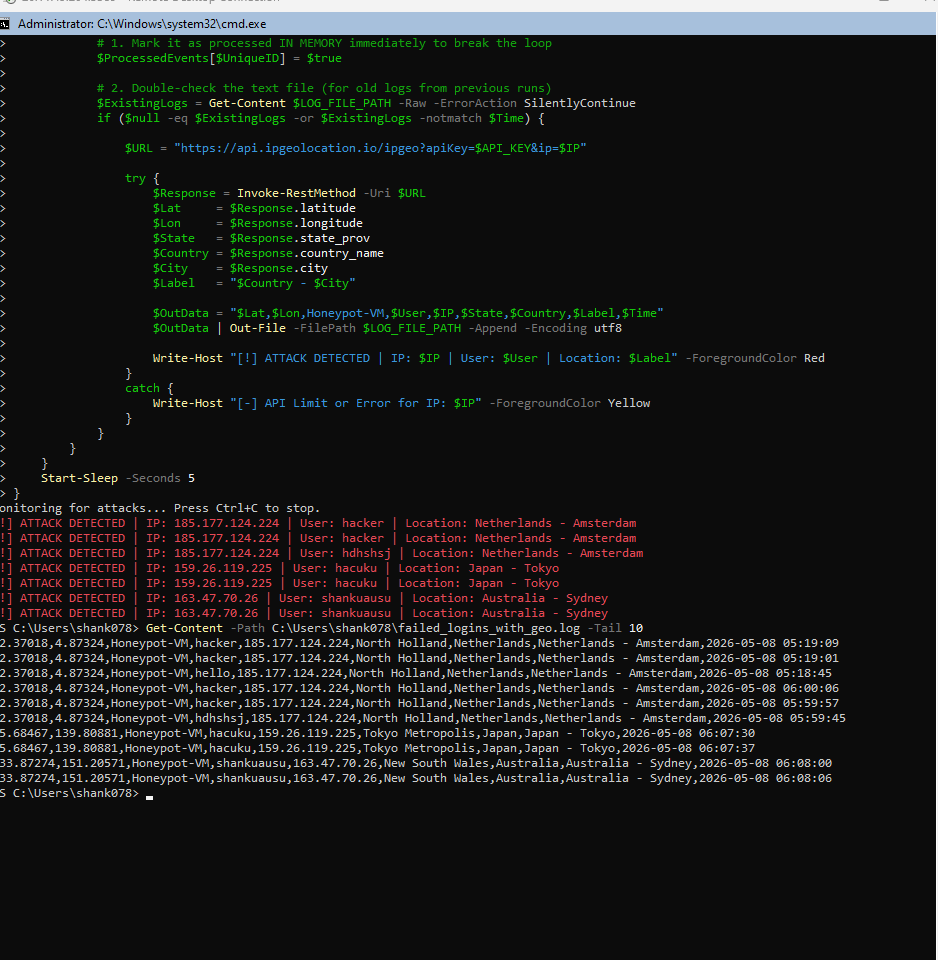	Custom .log schema verified — SIEM-ready output
16	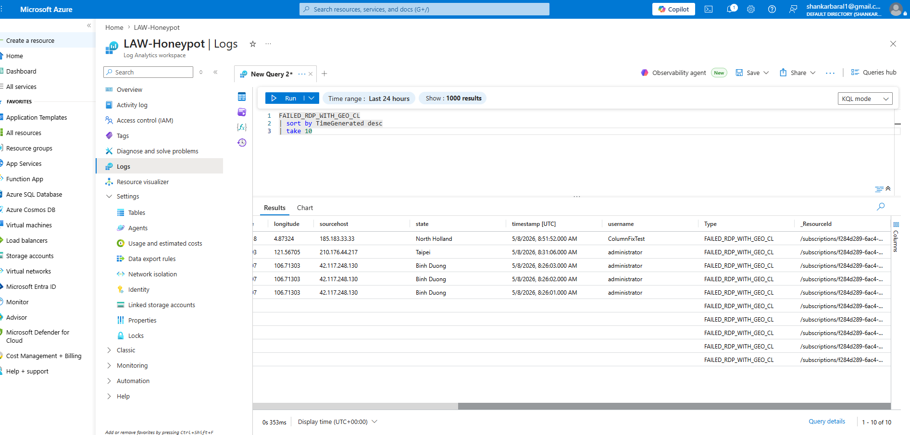	First query on custom Sentinel table confirmed
17		⭐ KQL strings converted to doubles for mapping
18	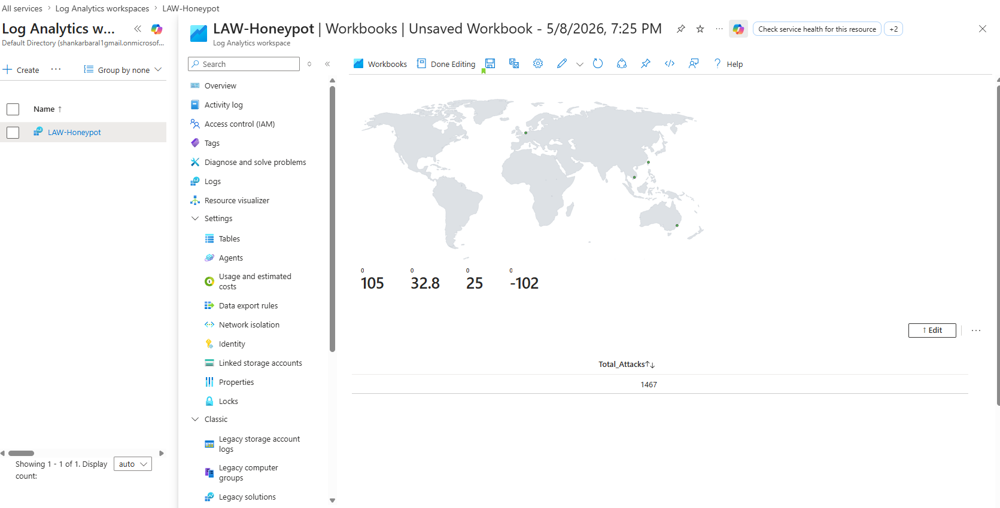	Workbook build and coordinate bug resolved
19	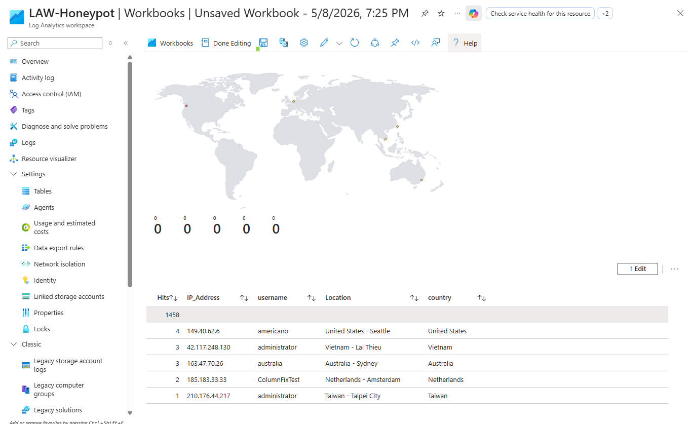	SOC dashboard with map + attack table aligned
20		⭐ Final SOC map — attack counts by country
21	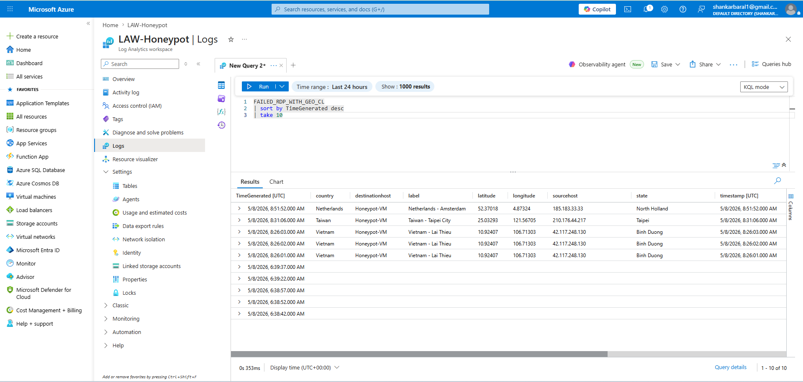	Custom fields (Lat, Long, Country) parsed in Sentinel
22		⭐ Controlled QA test with Shankar_Test_AU
23	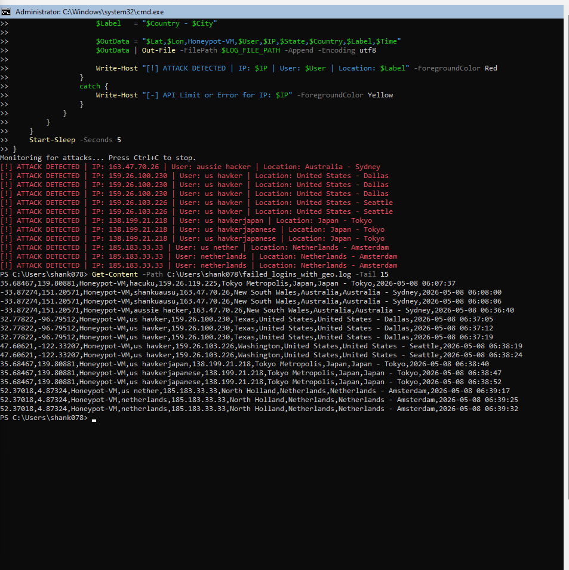	High-velocity attack sequence — Japan, USA, Netherlands
---
⚠️ Disclaimer
This project intentionally exposes a virtual machine to the public internet with weakened security configurations for educational and portfolio purposes only. The honeypot VM was deployed in an isolated Azure environment owned and operated by the project author. No production systems, personal data, or third-party assets were involved. Do not deploy these configurations in a production environment.
---
👤 Author
Shankar Baral
Aspiring Junior Cyber Security Analyst | SOC L1
[](https://www.linkedin.com/in/shankarbaral1/)
[](https://github.com/shank078)
---
This lab was built to learn by doing. If the internet wants to attack, we might as well be watching — and mapping every single one.
